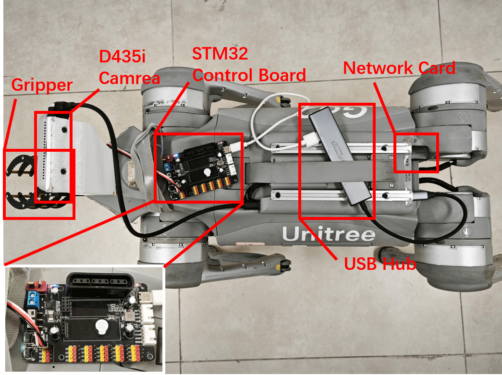
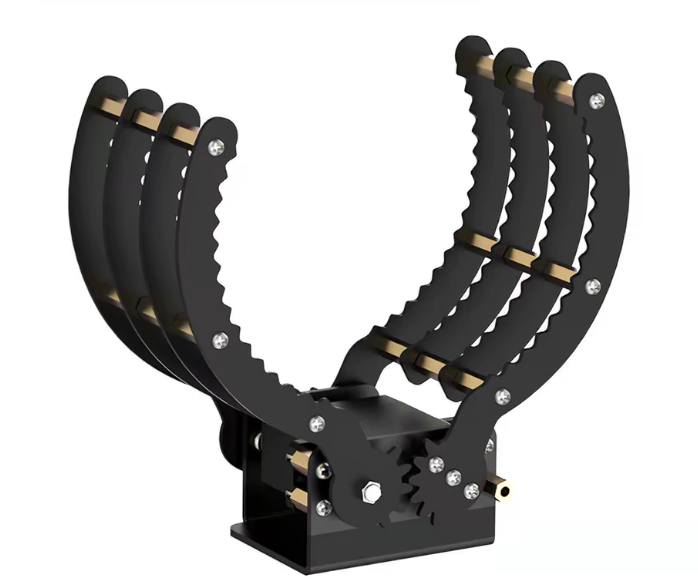

# Hardware

## Current Reference Setup

This page records the current hardware list and connection notes for the real-robot setup used by SigLoMa.

The annotated setup includes the gripper, Intel RealSense D435i camera, STM32 servo control board, USB hub, and high-bandwidth network card used in the current deployment configuration.

## 3D-Printed Mounts

- Use the gripper mount and camera mount from <https://helpful-doggybot.github.io/>.

## Network

- Use a high-bandwidth network card on the robot side. A link capacity above 500 Mbps is recommended.
- Keep the network stable enough to stream images from the robot to the local operator machine for real-time visualization.

## Gripper

- Purchase link: <https://e.tb.cn/h.iBchUas0FycGMxg?tk=kMPV5LTGInX>
- 

- Recommended accessories:
  - a high-torque servo motor to replace the stock servo
  - an STM32-based servo controller board
